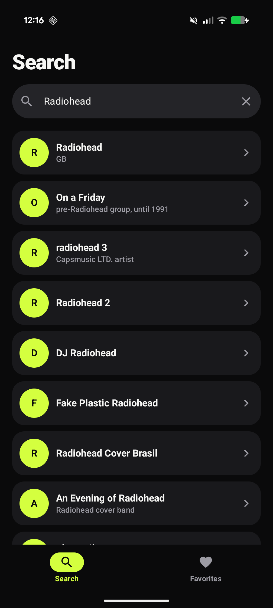
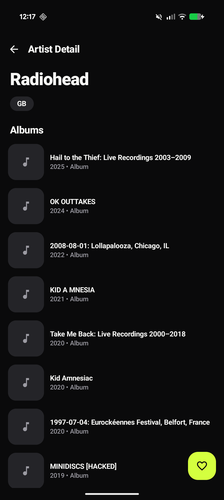
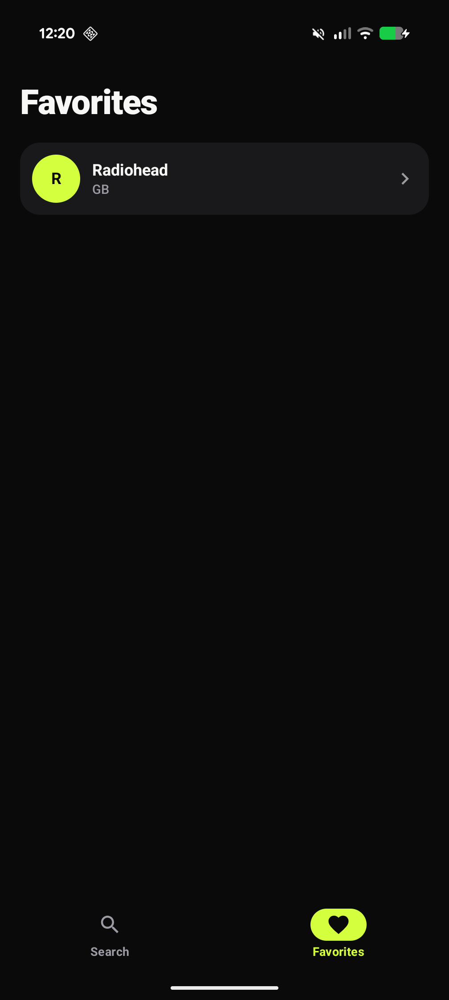

# DICEChallenge

An Android app for browsing music artists via the [MusicBrainz](https://musicbrainz.org/) API.
Search for an artist, view their profile and discography, and save favorites locally for
offline access. Built with Kotlin and Jetpack Compose, following Clean Architecture principles
with a reactive, `Flow`/`StateFlow`-driven UI layer.

<p align="center">
  
</p>

---

## 📸 Screenshots

| Search | Artist Detail | Favorites |
|---|---|---|
|  |  |  |

---

## 📚 Table of Contents

- [Tech Stack & Architecture](#-tech-stack--architecture)
- [Architectural & Design Decisions](#-architectural--design-decisions)
- [Requirements](#-requirements)
- [Getting Started](#-getting-started)
- [Building the App](#-building-the-app)
- [Running the App](#-running-the-app)
- [Running Tests](#-running-tests)
  - [Unit Tests](#-unit-tests)
  - [Instrumentation Tests](#-instrumentation-tests)
- [AI-Assisted Development](#-ai-assisted-development)

---

## 🛠️ Tech Stack & Architecture

* **Language:** [Kotlin](https://kotlinlang.org/) 2.2.10
* **UI:** [Jetpack Compose](https://developer.android.com/jetpack/compose) (Compose BOM
  2026.02.01) for a fully declarative UI, with Navigation Compose for the Search → Detail and
  Search/Favorites bottom-nav flow.
* **Architecture:** Clean Architecture (`data` / `domain` / `presentation` / `core` packages)
  inside a single Gradle module (`:app`) — see [Architectural & Design Decisions](#-architectural--design-decisions)
  for why.
* **UI Layer:** Composable screens observing `StateFlow<UiState>` exposed by each ViewModel.
* **ViewModel Layer:** `ViewModel`s expose UI state and handle user actions directly (e.g.
  `loadInfo()`, `onFavoriteToggle()`), backed by `kotlinx.coroutines` `Flow`/`StateFlow`.
* **Domain Layer:** Use cases (`GetArtistDetailUseCase`, `SearchArtistsUseCase`,
  `ToggleFavoriteUseCase`, etc.) encapsulating single business operations.
* **Data Layer:** Repositories (`ArtistRepositoryImpl`, `FavoritesRepositoryImpl`) abstracting
  the network (MusicBrainz via Retrofit) and local persistence (Room) behind domain interfaces.
* **Dependency Injection:** [Koin](https://insert-koin.io/) 4.0.0.
* **Networking:** Retrofit 2.11.0 + OkHttp 4.12.0 + kotlinx.serialization for JSON.
* **Persistence:** Room 2.7.0 (favorites are stored locally; see below).
* **Pagination:** Paging 3 (3.3.5) for artist search results.
* **Image loading:** Coil 2.7.0.
* **Async:** Kotlin Coroutines & Flow (kotlinx.coroutines 1.9.0).
* **Testing:**
  * **Unit tests:** JUnit 4, MockK, Turbine, `kotlinx-coroutines-test`, Koin's test module.
  * **UI/Instrumentation tests:** Jetpack Compose Test Rules, Espresso, AndroidX Test.
  * Shared test fakes (`FakeArtistRepository`, `FakeFavoritesRepository`, ...) live in a
    `testFixtures` source set so both unit and instrumentation tests reuse them.

---

## 🏛️ Architectural & Design Decisions

This section covers the non-obvious decisions made on this project and the reasoning behind
them.

### 1. Single module, Clean Architecture via packages

**Decision:** The project is a single Gradle module (`:app`), with Clean Architecture expressed
as packages (`data`, `domain`, `presentation`, `core`, `di`) rather than separate Gradle
modules.

**Rationale:** For a project of this scope, a multi-module split would add Gradle build
overhead without a matching payoff — there's no separately-reusable component or independent
build target here. The same separation of concerns (UI knows nothing about Retrofit/Room; the
domain layer only depends on repository interfaces) is enforced by package boundaries and code
review instead.

**Scaling to feature modules:** the current package boundaries were chosen so that this split is
mechanical, not a rewrite, if the app grows enough to justify it. `core` and `di` map onto a set
of `:core:*` modules (`:core:network` for Retrofit/OkHttp, `:core:database` for Room,
`:core:ui` for the shared theme/design-system composables, `:core:domain` for the shared models
and the `Result`/`DataError` types), and each `presentation` subpackage maps onto its own
`:feature:*` module (`:feature:search`, `:feature:detail`, `:feature:favorites`), each owning its
screen, ViewModel, use cases, and Koin module, and depending only on the relevant `:core:*`
modules — never on another feature module directly. The `:app` module would shrink to
`DiceChallengeApp`, DI wiring, and the navigation graph tying the feature modules together. That
split would buy incremental/parallel build times and a Gradle-enforced dependency graph (a
feature module physically cannot depend on another feature module by accident), at the cost of
more build-config overhead — worth it once there are enough features/contributors for that to
outweigh the added ceremony, not before.

### 2. Offline-first favorites

**Decision:** `FavoritesRepositoryImpl` treats the local Room database as the source of truth.
`observeAll()` and `observeIsFavorite()` are reactive `Flow`s driven directly by Room queries.

**Rationale:** The favorites feature has no server component — favoriting is inherently a local
action. Modeling it as a reactive local `Flow` (instead of one-shot reads with manual refresh)
means the favorite heart icon, the favorites list, and any other observer of favorite status
stay in sync automatically whenever the underlying table changes, with no polling or manual
invalidation.

### 3. Independent, section-level loading on the Artist Detail screen

**Decision:** On the Artist Detail screen, the artist header and the discography (albums)
section are fetched, loaded, and retried **independently** of each other. `ArtistDetailViewModel`
combines two separate `StateFlow`s (`combine(_artistState, _releaseGroupsState, ...)`) into the
exposed UI state, so whichever of the two resolves first is never blocked or lost waiting on the
other.

**Rationale:** The artist profile and the discography come from two separate MusicBrainz
endpoints. Treating them as a single all-or-nothing result meant a discography-only failure
(e.g. that endpoint being slow or erroring) would fail the *entire* screen, even though the
artist's name, country, and basic info had already loaded successfully. Splitting them lets the
artist header render as soon as it's ready and gives the albums section its own inline
error/retry, independent of the artist call's outcome.

### 4. Per-endpoint HTTP caching

**Decision:** A custom OkHttp `Cache` plus a `ForceCacheInterceptor` (in `di/NetworkModule.kt`)
rewrite the `Cache-Control` header on successful `GET` responses, applying a different max-age
per MusicBrainz endpoint (1 hour for artist lookups, 24 hours for release-groups/discography).

**Rationale:** MusicBrainz doesn't send caching headers tuned for a mobile client, and artist/
discography data changes infrequently. Forcing endpoint-specific cache lifetimes cuts redundant
network calls (e.g. re-opening the same artist's detail screen) without needing a separate
in-app caching layer.

### 5. Centralized dependency management via Gradle Version Catalog

**Decision:** All dependency coordinates and versions live in `gradle/libs.versions.toml`.

**Rationale:** A single, type-safe source of truth for versions avoids drift between different
parts of the build and keeps `build.gradle.kts` readable (`libs.coil.compose` instead of a raw
Maven coordinate string).

---

## ✅ Requirements

* **Android Studio** (a recent version supporting AGP 9.2.1 / Kotlin 2.2.10)
* **JDK 17+**
* **Android SDK** with API 37 installed (the app targets/compiles against API 37, minSdk 29)
* **Git**
* An **Android device** with developer mode + USB debugging enabled, or an **Android emulator**

---

## 🚀 Getting Started

### 1. Clone the repository

```
git clone https://github.com/mutiss/DICEChallenge.git
```

### 2. Open the project in Android Studio

1. Open **Android Studio**
2. **File → Open**, select the cloned folder
3. Let **Gradle** sync and finish indexing

### 3. No API key needed

The app talks to the public [MusicBrainz API](https://musicbrainz.org/doc/MusicBrainz_API),
which is free and keyless — `BASE_URL` is baked into the build via `buildConfigField` in
`app/build.gradle.kts`, and a descriptive User-Agent header (required by MusicBrainz's usage
policy) is set in `di/NetworkModule.kt`. There is no `local.properties` setup step required
beyond the standard `sdk.dir` that Android Studio manages for you.

### 4. Configure an emulator or device

* Set up a virtual device from **AVD Manager**, or
* Connect a **physical device** with **USB debugging** enabled

---

## 🏗️ Building the App

### From Android Studio

Use **Build → Make Project**, or click the **hammer icon** on the toolbar.

### From the command line

```
./gradlew assembleDebug
```

---

## ▶️ Running the App

### From Android Studio

1. Select the **`app`** run configuration
2. Choose an **emulator** or **connected device**
3. Click **Run ▶️**

### From the command line

```
./gradlew installDebug
```

---

## ✅ Running Tests

### 🧪 Unit Tests

Run on the local JVM.

```
./gradlew testDebugUnitTest
```

Or, in Android Studio: right-click the `app/src/test` package (or a specific test class) and
select **Run "Tests in …"**.

### 🧠 Instrumentation Tests

Run on an emulator or physical device — covers Room DAO tests and Compose UI tests for the
Search, Detail, and Favorites screens.

```
./gradlew connectedDebugAndroidTest
```

Or, in Android Studio: with a device/emulator running, right-click the `app/src/androidTest`
package (or a specific test class) and select **Run "Tests in … on device/emulator"**.

Both source sets share fakes (`FakeArtistRepository`, `FakeFavoritesRepository`,
`FakeArtistPagingSource`) defined once in `app/src/testFixtures`, and a `KoinModulesTest` verifies
the full Koin dependency graph resolves correctly.

---

## 🤖 AI-Assisted Development

AI tools were used throughout this project's development — for test generation, architecture
discussions, and code review — alongside human review of everything before it was committed.
See [`AI_USAGE.md`](AI_USAGE.md) for the full disclosure of which tools were used and for what.
